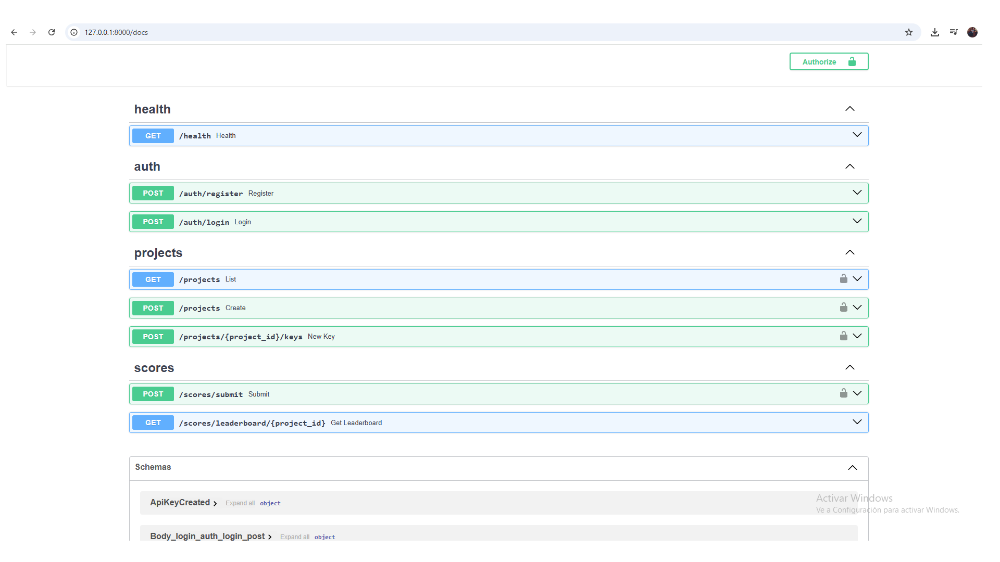

# Scoreforge

**Scoreforge** is a multi-tenant leaderboard SaaS for games.

It includes:
- A **developer dashboard** (web) to register/login, create projects, and generate **API keys**.
- A **public API** that game clients (e.g., **Godot**) can use to **submit scores** and **fetch leaderboards**.

> Status: MVP functional (local). Production hardening is documented in `docs/`.

---

## What you can do (MVP)

- ✅ Register / Login (JWT for dashboard)
- ✅ Create projects (multi-tenant boundary)
- ✅ Generate a **stable** API key per project (shown once)
- ✅ Submit scores with `X-API-Key`
- ✅ Fetch a leaderboard (top N)

---

## Screenshots

| Login | Dashboard | API Docs |
|---|---|---|
|  |  |  |

---

## Tech Stack

- **Backend:** FastAPI, SQLAlchemy, PostgreSQL (Neon), JWT
- **Frontend:** Next.js (React)
- **Client:** Godot 4.x (HTTP)

---

## Security model (important)

Scoreforge uses **two** auth mechanisms:

1) **JWT (Authorization: Bearer <token>)**  
   For **dashboard users**: create projects, generate API keys.

2) **API key (X-API-Key: <key>)**  
   For **game clients**: submit scores / read leaderboards.

API keys are:
- generated once and **returned once**
- stored **hashed** in the database (server never stores plaintext keys)

---

## Project structure

```
scoreforge/
  backend/          FastAPI app
  frontend/         Next.js app
  docs/             API + architecture + deployment docs
```

---

## Quick start (Local, without Docker)

### 1) Backend

```powershell
cd backend
python -m venv venv
.\venv\Scripts\activate
pip install -r requirements.txt
copy .env.example .env
python -m uvicorn app.main:app --reload
```

Backend runs at:
- http://127.0.0.1:8000
- http://127.0.0.1:8000/docs

### 2) Frontend

```powershell
cd frontend
copy .env.local.example .env.local
npm install
npm run dev
```

Frontend runs at:
- http://127.0.0.1:3000

---

## Docker (optional)

If you want **one command** to run everything locally (Postgres + API + Web):

```bash
docker compose up --build
```

See `docker-compose.yml` for details.

---

## Documentation

- `docs/api.md` – Endpoints + request/response examples
- `docs/architecture.md` – Components + auth model + data flow
- `docs/deployment.md` – Neon + Render/Vercel deployment notes

---

## Roadmap (next professional steps)

- [ ] Alembic migrations in CI (no `create_all` in production)
- [ ] Rate limiting & abuse protection (API key endpoints)
- [ ] Observability (structured logs + request IDs)
- [ ] Per-project score rules (unique players, anti-cheat basics)
- [ ] Godot client packaged as a small addon

