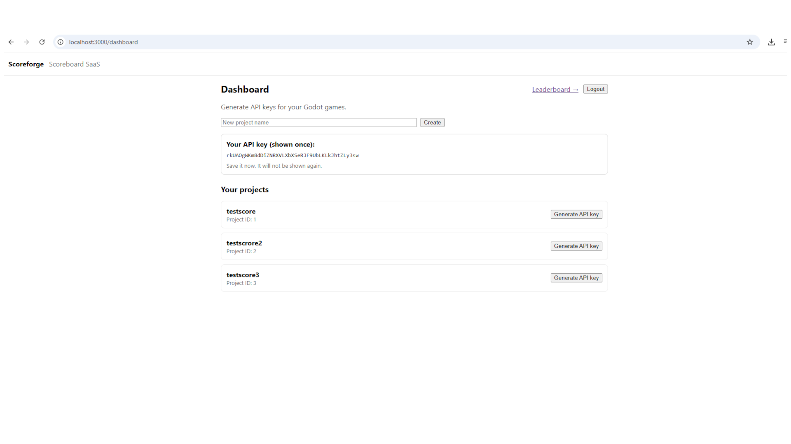
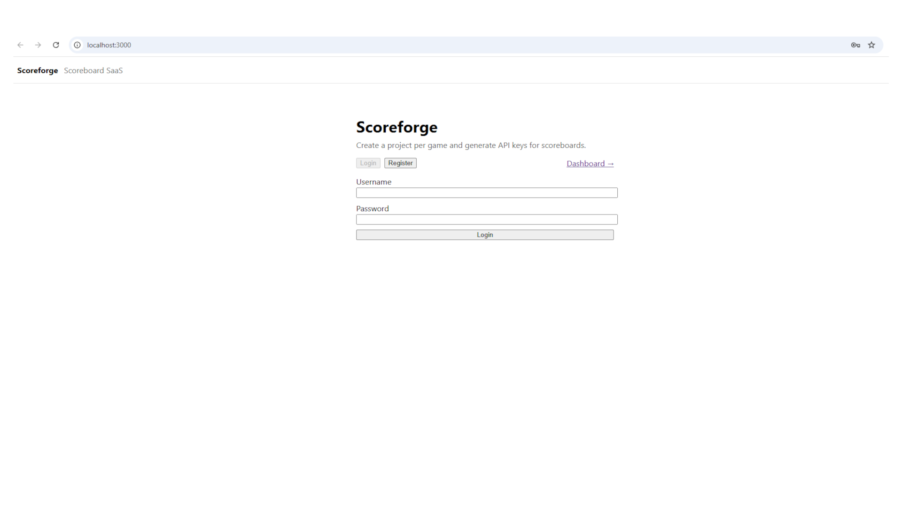

# Scoreforge

## Status
MVP functional (local). Docker and deployment hardening in progress.

Scoreforge is a multi-tenant leaderboard SaaS for games.
It provides a dashboard to create projects and generate API keys, and an API that game clients can use to submit scores and retrieve leaderboards.

---

## Features
- JWT authentication for dashboard users
- Stable per-project API keys (stored hashed; shown once)
- Score submission via `X-API-Key`
- Leaderboard retrieval endpoint
- Swagger docs (`/docs`)

---

## Tech Stack
**Backend:** FastAPI, SQLAlchemy, PostgreSQL (Neon), JWT  
**Frontend:** React / Next.js

---


## 🖥 Screenshots




---

## Quick Start (Local)

### Backend (Windows)
```bash
cd backend
python -m venv venv
venv\Scripts\activate
pip install -r requirements.txt
copy .env.example .env
python -m uvicorn app.main:app --reload
